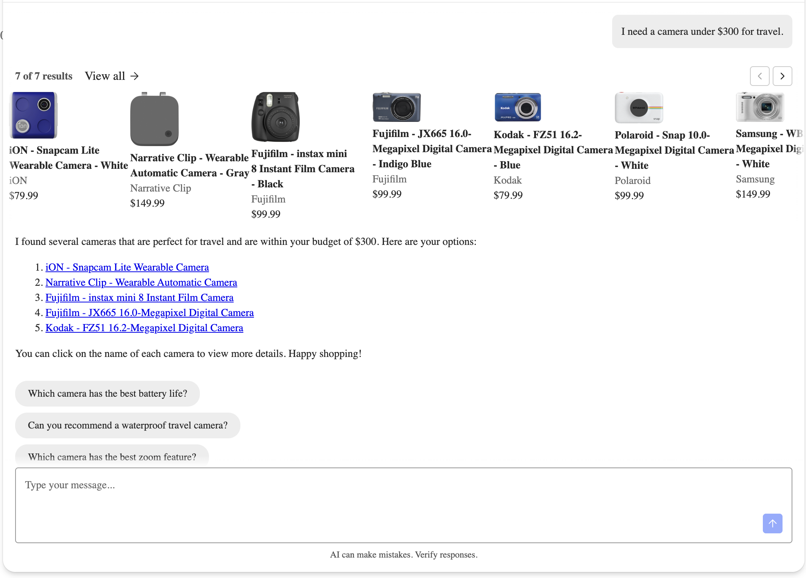
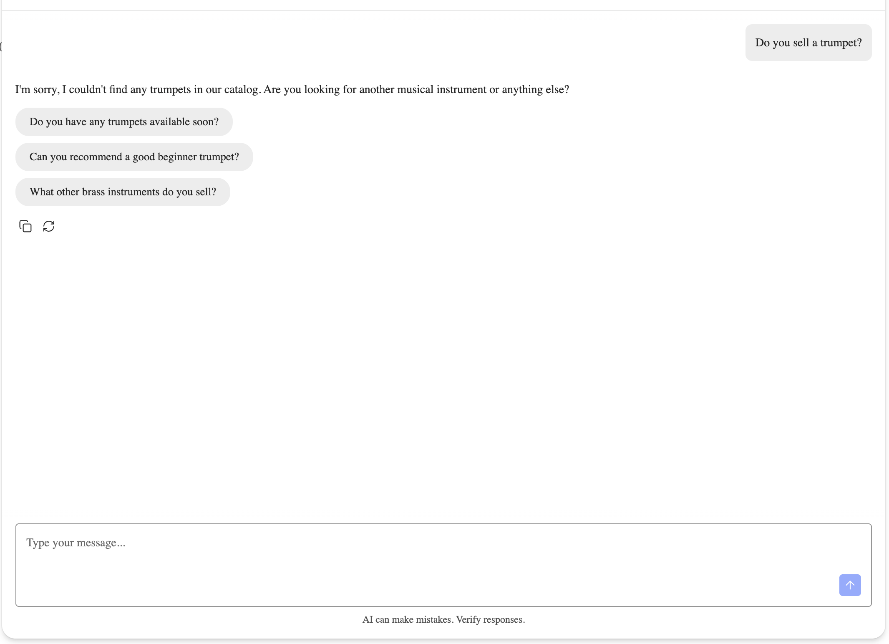
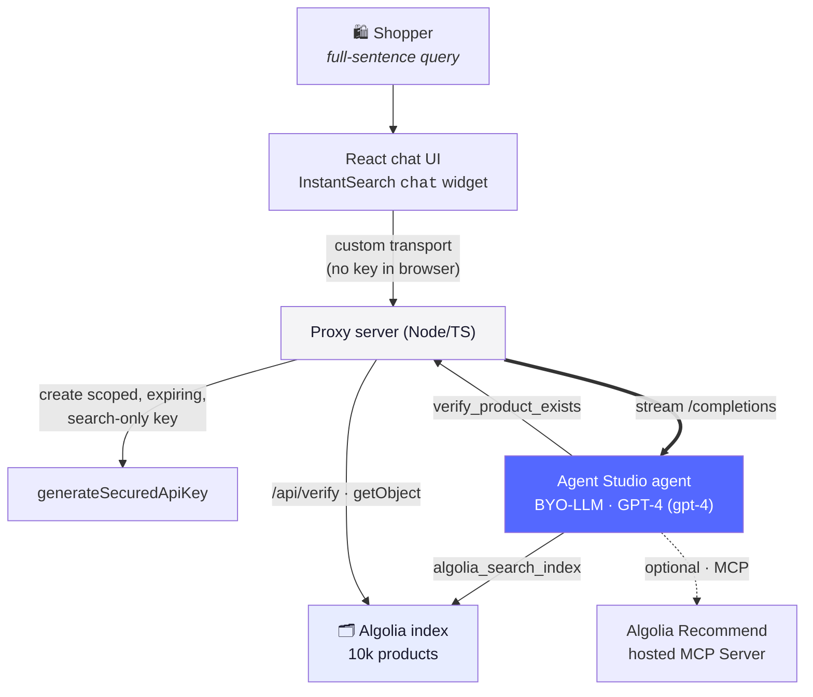
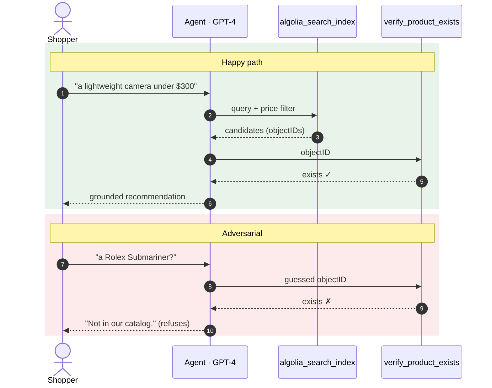

<p align="center">
  
</p>

# Building a Grounded Shopping Assistant on Algolia Agent Studio

Build a conversational shopping assistant that takes a full sentence (*"a lightweight camera under $300 for travel"*) and answers it **only from your real catalog**: no invented SKUs, no made-up prices, no fake stock. It runs on [Algolia Agent Studio](https://www.algolia.com/doc/guides/algolia-ai/agent-studio) driving a bring-your-own LLM (OpenAI GPT-4) over Algolia retrieval, with a server-side guard that turns away any product the index cannot confirm. The point isn't that a bigger model hallucinates less. It's that *grounding* (retrieve, verify, refuse when empty) keeps the assistant honest regardless of model size.

[](https://nodejs.org/)
[](https://www.algolia.com/doc/guides/algolia-ai/agent-studio)
[](https://www.algolia.com/doc/api-reference/widgets/chat/react)
[](https://openai.com/)
[](#a-note-on-beta)

> **TL;DR.** Across 24 probes through the live agent, grounding held on **every** out-of-catalog question: the assistant **never invented a product (12/12)**. It returned real products on **10/12** in-catalog queries and gave a clean, card-free refusal on **9/12** out-of-catalog ones. The key insight: the real enforcer is an **empty search**, not the model's prose refusal, so the `verify_product_exists` tool is a fallback, not the primary defense. And turning grounding *on* is a config step; the genuinely hard part is **relevance**: a query for "camera under $300" first returned a camera *bag*, and fixing that took index-and-tool tuning, not a prompt tweak.

<p align="center">
  
  
  <br/>
  <em>An in-catalog answer grounded in real products, and a clean out-of-catalog refusal with no stray card. Same assistant, both behaviors.</em>
</p>

---

## Contents

- [How it works](#how-it-works)
- [Does it stay grounded?](#does-it-stay-grounded)
- [The grounding loop](#the-grounding-loop)
- [The hard part: relevance](#the-hard-part-relevance)
- [How grounding is enforced](#how-grounding-is-enforced)
- [The catalog](#the-catalog)
- [Run it](#run-it)
- [Project layout](#project-layout)
- [The tutorial](#the-tutorial)

---

## How it works

Every shopper message becomes a single Agent Studio turn: the model reads the sentence, calls Algolia's built-in `algolia_search_index` tool to retrieve candidates, verifies any product before committing to it, and streams an answer back, all with **no Algolia key ever reaching the browser**. The model brings language understanding; Algolia brings the facts.



Built and verified against **Node 22**, `algoliasearch` **5.56**, and `react-instantsearch` **7.39**, driving Agent Studio through `compatibilityMode=ai-sdk-5`. The default model is `gpt-4`; swap in `gpt-4o` or `gpt-4o-mini` for lower cost.

---

## Does it stay grounded?

Grounding is a behavior to measure, not assume, so the repo ships an eval (`npm run eval`) that pushes a batch of in-catalog and out-of-catalog queries through the **live** agent. The last run:

| Probe set | Metric | Result |
|---|---|---|
| Out-of-catalog (12 queries) | refused in the answer text | **12/12** |
| Out-of-catalog (12 queries) | clean refusal, no stray card | 9/12 |
| In-catalog (12 queries) | returned real products | 10/12 |

The headline is the **12/12**: the agent never invented a product, so grounding held on every out-of-catalog probe. The gaps are *relevance gaps, not hallucinations*: the two in-catalog misses were an over-constrained query returning zero hits, and the three out-of-catalog queries that still showed a card (a leather sofa, a cowboy hat, a yoga mat) are a fuzzy-match leak, where the agent refused in prose while the search returned a loose match. That gap is exactly why the enforcer has to be the *search*, not the text.

---

## The grounding loop

Every answer passes through the out-of-index guard, grounded or refused:



---

## The hard part: relevance

Never inventing a product is the easy part. Getting *good* results is the other 80%, and it took several rounds of index and tool tuning. Here is what "a camera under $300" returned before any of it, straight from the live index:

```
Before:  "camera under $300"
  → Canon Camera Bag        $59.99   (Camera Bags & Cases)
  → Digipower Stabilizer    $59.99   (Camcorder Accessories)
  → spare battery, memory card, lens cap …
```

Real products, real prices, and useless: the shopper asked for a camera and got a bag. Two bugs were tangled together:

- **The word is in the accessories.** Faceting `camera` on `categories` shows the broad `Cameras & Camcorders` umbrella (753 hits) is mostly accessories, while `Digital Cameras` (165) is what the shopper wants. Fix: prompt the agent to pick the specific product-type category and skip anything named "Accessories", "Bags", or "Batteries".
- **Numeric budgets don't filter the way you expect.** Agent Studio's search tool picks facet *values* and **AND-s** them, so selecting `$0–100` AND `$100–200` AND `$200–300` returns **0 results**. Fix: a cumulative `budget_fits` facet that tags each product with every tier it fits under, so one value (`under $300`) covers everything cheaper.

```
After:  "camera under $300"
  → iON Snapcam Lite   $79.99   · Fujifilm instax mini 8  $99.99
  → Kodak FZ51         $79.99   · Polaroid Snap           $99.99
  → Samsung WB35F     $149.99
```

Five real cameras, all under budget, deduped from color variants with `attributeForDistinct: "model"`.

---

## How grounding is enforced

Grounding rests on three pieces, all server-side:

- **A secured key.** The server derives a scoped, one-hour, search-only key from a parent key with `generateSecuredApiKey`, computed locally so the parent key never leaves the machine. Nothing reaches the browser; check the Network tab and you'll find no Algolia key.
- **The empty search (primary defense).** A query with no catalog match returns nothing, so the agent has nothing to present. This, not the model's wording, is what keeps a stray card off the screen.
- **The verify guard (fallback).** For the narrower case where the model *guesses* an `objectID`, `verify_product_exists` looks it up directly in Algolia; a made-up id resolves to nothing and the guard returns `exists: false`. Watch the proxy log for `[verify_product_exists] … → NOT FOUND (guard refused)`.

---

## The catalog

The assistant is grounded in real, structured product records (name, brand, price, categories, image) from Algolia's ~10,000-product ecommerce demo catalog:

<p align="center">
  
  
  
  
  
</p>

---

## Run it

**Prerequisites**

- Node.js ≥ 18.17
- A free Algolia **Build** plan application (no credit card): [dashboard.algolia.com](https://dashboard.algolia.com)
- An OpenAI API key for the bring-your-own-LLM provider profile

**Install and configure**

```bash
npm install
npm run web:install
cp .env.example .env
# Fill in ALGOLIA_APP_ID, ALGOLIA_ADMIN_KEY, ALGOLIA_SEARCH_KEY, ALGOLIA_INDEX_NAME.
```

In the Algolia dashboard: copy your **App ID**, **Admin key**, and a **search-only key** (Settings → API Keys). The Admin key is used *only* by the indexing script; the search-only key is the parent the server derives secured keys from. Then add an **OpenAI** provider profile (Settings → Agent Studio → LLM providers) and copy its id into `ALGOLIA_PROVIDER_ID`.

**Index, deploy, run**

```bash
npm run index          # index the ~10k demo products
npm run agent:deploy   # create & publish the agent, prints an agent id
#   put the printed id into ALGOLIA_AGENT_ID in .env

npm run dev:server     # terminal 1: the proxy
npm run dev:web        # terminal 2: http://localhost:5173
```

Open [http://localhost:5173](http://localhost:5173), click the chat button, and try both paths:

- **Grounded:** *"a lightweight camera under $300 for travel"* → the agent searches, verifies, and quotes a real product.
- **Refused:** *"do you sell a Rolex Submariner?"* → the agent declines; watch the proxy terminal for `guard refused`.

Prefer to read before running? Every result is captured in the tutorial, so you can see the numbers without deploying anything.

---

## Project layout

| Path | What it does |
|---|---|
| `scripts/index-catalog.ts` | Indexes Algolia's 10k ecommerce demo catalog (`algoliasearch` v5). |
| `scripts/eval.ts` | The grounding eval: in-catalog and out-of-catalog probes against the live agent. |
| `agent/agent.config.json` | The agent as version-controlled config: model + tools. |
| `agent/deploy-agent.ts` | Creates & publishes the agent via the Agent Studio REST API. |
| `server/secured-key.ts` | Creates a scoped, expiring, search-only key with `generateSecuredApiKey`. |
| `server/tools/verify-product.ts` | The out-of-index guard: looks an `objectID` up in the index. |
| `server/index.ts` | Proxy: `/api/chat` (streaming) + `/api/verify`. |
| `web/` | React InstantSearch `chat` widget wired to the proxy via a custom transport. |
| `TUTORIAL.md` | The companion tutorial: the full build, end to end. |

---

## The tutorial

This repository is the companion to the tutorial in [`TUTORIAL.md`](./TUTORIAL.md), which walks the whole build end to end: indexing the catalog, defining the agent as config, creating the secured key, wiring the guard, and the relevance tuning that grounding does *not* solve on its own.

### A note on beta

Agent Studio and the InstantSearch `chat` widget are both **beta**; their shapes can move between minor versions, which is why the dependencies above are pinned. Free-tier quotas change too; re-check Algolia's pricing before relying on exact numbers.
